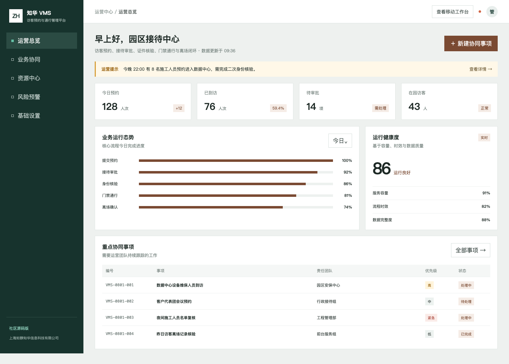
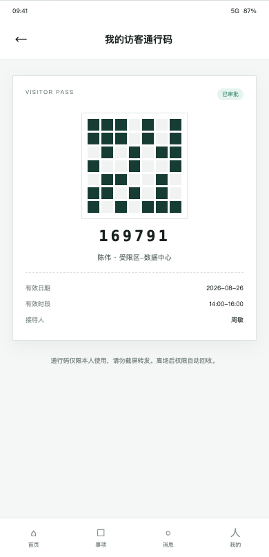
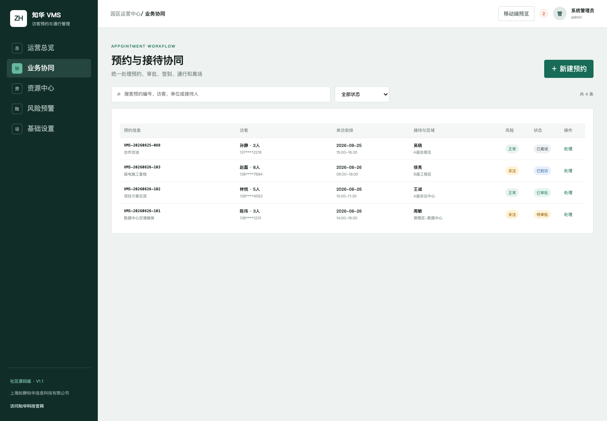
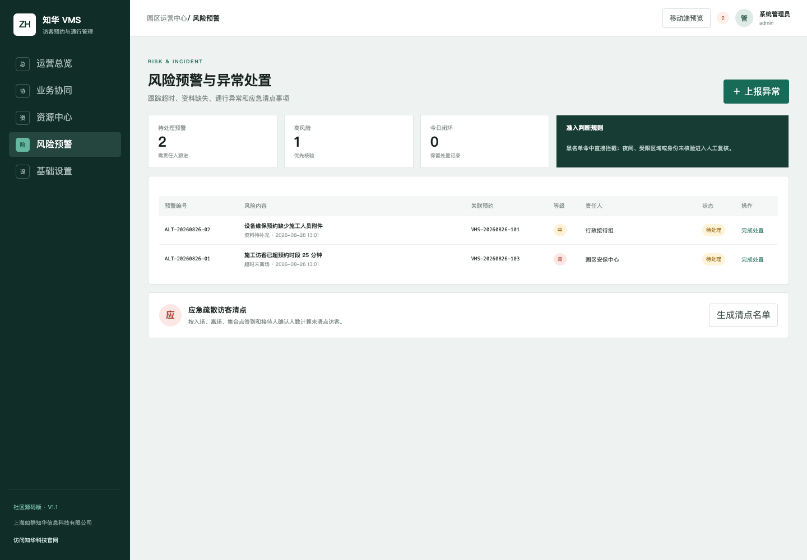
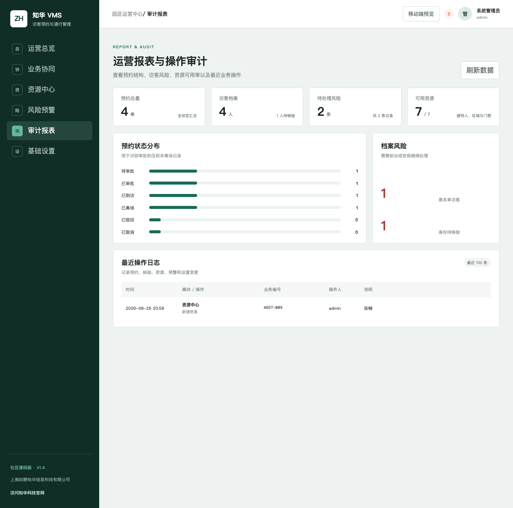

# ZhuaTech VMS · 访客预约与通行管理

> 知华科技（上海如静知华信息科技有限公司）发布的访客管理社区源码项目。官网：[https://www.zhuatech.cn/](https://www.zhuatech.cn/)



## 从预约到离场，一条可追踪的访问链路

ZhuaTech VMS 将预约提交、接待人审批、身份核验、通行授权、在园关注和离场确认放入同一个前后端分离样例。管理端服务于前台与安保中心，移动端服务于接待人和访客，可用于学习园区访客业务、权限隔离和响应式 H5 实现。

| 流程阶段 | 系统能力 | 责任角色 |
| --- | --- | --- |
| 预约前 | 到访事由、人员名单、时间和区域登记 | 访客 / 接待人 |
| 到访前 | 接待确认、实名核验、准入风险评估 | 接待人 / 安保 |
| 在园中 | 一次性通行码、区域限制、超时提醒 | 前台 / 安保 |
| 离场后 | 通行回收、离场确认、异常留痕 | 前台 / 管理员 |



<p align="center"><em>移动端：预约、签到、通行码和接待提醒的专业 H5 工作台</em></p>

## 已实现模块

| 模块 | 用户能力 |
| --- | --- |
| 运营总览 | 今日预约、待审批、在园访客、待处理预警、流程进度和最近预约 |
| 业务协同 | 新建与修改预约、审批、驳回、取消、签到、通行码和离场闭环 |
| 资源中心 | 访客档案、身份核验状态、来访记录、黑名单、接待人、区域和门禁点 |
| 风险预警 | 准入风险判断、异常上报、处置留痕、超时未离场和应急疏散清点 |
| 运营审计 | 预约状态报表、档案风险、资源可用率和最近关键操作追溯 |
| 企业管控 | 多园区、分级审批、承包商资质、预约材料、访客证、门禁事件、通知重试、应急清点和合规预检 |
| 基础设置 | 园区、审批方式、通行时段、消息渠道、数据留存和账号权限 |
| 移动工作台 | 发起预约、访客签到、通行码、异常上报、接待待办和提醒 |

后端采用 Spring Boot 4、Java 21、Spring Security、JPA 和 MySQL；前端采用 Vue 3、Vite，并同时提供管理端和响应式 H5。状态流转会校验操作顺序，例如“待审批”不能直接签到，“已审批”不能直接离场。

### V1.7 多园区与承包商合规升级

- 新增企业园区主数据，独立维护园区编码、名称、地址、时区、单时段容量、应急集合点和启停状态；预约只能选择有效园区，容量按园区隔离计算。
- 新增承包商资质台账，记录资质类型、证书编号、有效期、安全培训和冻结状态。施工、维保和承包作业会自动进入承包商合规校验。
- 新增预约材料元数据与 SHA-256 校验值，支持身份证明、安全承诺书、作业人员清单等材料提交、管理员审核、驳回意见和完整审计留痕。
- 受限区域最终安保复核增加强制合规门禁：材料未提交、未审核通过，或者承包商资质失效时，服务端拒绝放行。
- 新增基于真实“已到访”预约的园区应急清点快照，聚合访客人数、接待人、访客证、最后门禁位置和集合点。
- 新增管理员预约 CSV 导出，限制一年内日期范围并记录导出审计；运营角色无权导出。
- 管理端增加多园区选择、预约材料审核、“资质与应急”工作区和实时清点名单；后端自动化测试总数提升到 19 项。

### V1.6 现场执行与合规升级

- 新增实体访客证全生命周期：库存、发放、归还、离场自动回收和挂失；挂失后自动形成高风险预警并提示冻结门禁权限。
- 新增门禁事件接入接口及管理端操作台。每次允许或拒绝均独立留痕，并基于预约实时状态阻止重复入场、重复离场与黑名单访客通行。
- 新增持久化通知任务箱。预约创建、重新送审、审批、驳回、签到和离场会自动排队通知；站内消息可直接派发，企业微信和短信保留明确的适配入口、失败原因与重试机制。
- 新增合规留存预检，根据管理员设置的保留天数统计超期访客档案和审计日志，只输出影响范围，不自动删除业务数据。
- 管理端“企业管控”升级为审批治理、现场通行、消息与合规三个工作区，相关功能均调用真实持久化 API。
- 自动化测试增加现场闭环、反重复通行、自动回证、通知派发、权限隔离和留存预检场景，后端测试总数提升到 18 项。

### V1.5 企业能力升级

- 普通预约由接待人审批；受限区域或 8 人以上来访自动进入“接待人审批 → 安保复核”两级流程，安保复核仅管理员角色可执行。
- 每一审批阶段形成独立任务，保存责任人、截止时间、决策人、意见和处理时间，并在企业管控看板统计待办与超时 SLA。
- 支持单次最多 50 条批量预约；通过 `clientRequestId` 提供重复提交保护，并通过实体版本号避免并发覆盖。
- 管理员可配置单时段容量上限与审批 SLA；超容量预约在服务端直接拦截。
- 在园巡检会识别超过预约结束时间且尚未离场的访客，并以幂等方式生成风险预警。
- 通行核验会再次检查访客黑名单状态，即使通行码已签发也能实时冻结。

这些能力构成可运行、可测试的企业业务基线。生产部署仍应接入企业统一身份认证、正式消息渠道、证件核验与真实门禁，并按组织安全规范完成等保、隐私和灾备配置。







### 产品使用手册

- [ZhuaTech VMS 产品使用手册 V1.2（Word）](docs/知华科技-ZhuaTech-VMS-产品使用手册-V1.2.docx)
- [ZhuaTech VMS 产品使用手册 V1.2（PDF）](output/pdf/知华科技-ZhuaTech-VMS-产品使用手册-V1.2.pdf)

### 快速体验

```bash
cp .env.example .env
docker compose up --build
```

打开 `http://localhost:8090`。本地演示账号：`admin / admin123`、`operator / operator123`。这些默认值不得用于联网或生产环境。

```bash
curl -u admin:admin123 -H 'Content-Type: application/json' \
  -d '{"visitorCount":8,"afterHours":true,"restrictedArea":true,"hostConfirmed":true,"identityVerified":false,"blacklistHit":false}' \
  http://localhost:8080/api/admin/visit-risk
```

更多信息参见 [API](docs/API.md)、[架构](docs/ARCHITECTURE.md) 和 [安全政策](SECURITY.md)。社区源码版已经实现门禁事件接入协议、访客证闭环和可靠通知任务；权威身份证件核验、真实门禁控制器、访客机、企业微信和短信网关仍需按接口接入第三方服务。

## 许可边界

本工程仅能用于个人非商业学习、研究和技术交流。未经上海如静知华信息科技有限公司书面授权，不得用于企业内部生产、商业部署、SaaS、收费下载、售卖、外包交付、投标、品牌替换或任何直接、间接商业用途。本许可含非商业限制，因此不是 OSI 认可的开源许可证，详情见 [LICENSE](LICENSE)。

## 商业授权与深度定制

需要对接证件核验、闸机门禁、企业微信、访客机或多园区能力，可访问[知华科技官网](https://www.zhuatech.cn/)，也可扫描任一微信二维码咨询。

<p align="center">
  
  
</p>

关键词：知华科技 VMS、访客管理系统、访客预约、园区门禁、访客通行码、Java 访客系统、Vue 访客管理、上海软件开发。

## 应急疏散访客清点

新增 `POST /api/vms/insights/evacuation-accountability`，根据已入场、已离场、集合点签到和接待人确认人数计算在场及未清点访客，输出 `CLEAR / RECONCILE / LOCATE_NOW`。紧急状态下可直接生成联系接待人、核对最后门禁位置和现场查找动作。
